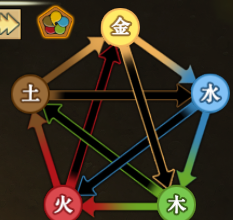
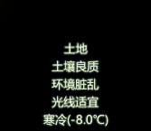
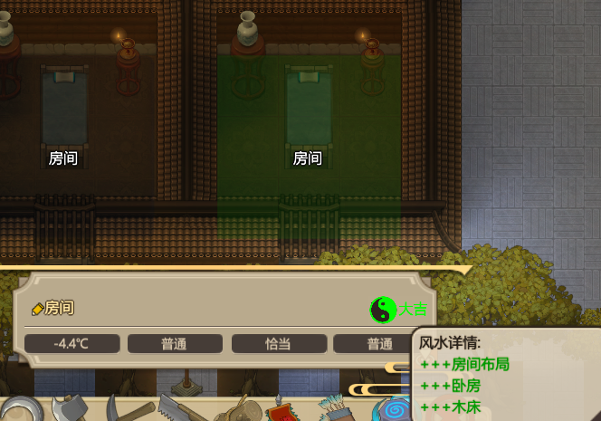
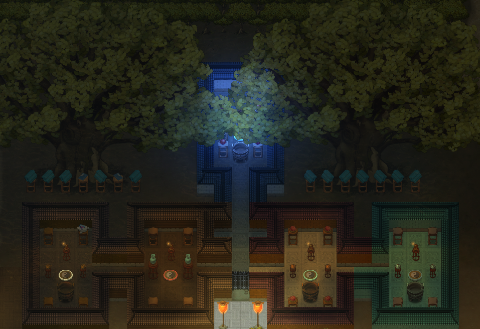

# 简单风水攻略

#### 何为风水？它是中华民族历史悠久的一门玄术，也被称为堪舆术、青囊术。像大家所熟悉的盗墓小说中提及的寻龙诀，便是堪舆术的一种。而在在了不起的修仙模拟器中，风水更是扮演着一个极为重要的角色。修仙嘛，其主旨便是与天争命，窃夺天机，所以在修行的方方面面，都讲究一个天时地利人和。在风水之中，讲究五行生克，如果有不懂的玩家，可以看下图：

#### 这是游戏左上角加速键旁边的五行生克图，外圈箭头表示相生，内圈箭头表示相克，如果在游戏中有疑惑，打开这个界面便会一目了然。在游戏里，玩家会出生在一片随机地图当中，周遭是一片生机勃勃的草地树林以及山石走兽。而我们所需要的做的，就是改变这片大自然，使其按照修仙者的意志新生。当然，开局没那么多讲究，风水是从我们第一个筑基成功，建立门派的天命之子开始的，当建立起观星台后，我们便可以清晰的查看每一个事物中的五行属性。不过这并不影响我们前期对门派的规划。如下图：

#### 这是游戏右下角所显示的数据，显示的是你当前鼠标所指区域的数据。请记住，在游戏中，除了特殊物品之外，其他物品都自带五行属性！所以，游戏里每一片区域，绝大多数物品，都会拥有各自的属性。上图所示的土地，土属性居多，那么建造与其相生的建筑，则会在风水上事倍功半。其中细节，在这就不细说了，留给各位玩家自行在游戏中体会。当然，也可以无视掉这一部分的属性，按照自己的规划去建筑，所需的不过是多建一些相关属性而已。

#### 以木屋为例，在其中建筑木床供修行者休息，五行中生木的是水属性，所以在床边放上水属性宝物或装饰物建筑，便能够起到相生的作用，从而达成风水上的大吉。当然，用水属性的墙更好，不过……请注意房间温度。而当一个房间内，大吉的建筑达标时，那么正个房间也就成了大吉建筑。如果这样还达不到，那么就是属性不够多，多放几个饰品就能解决。当然，一个房间内的空间有限，太过于空旷会影响风水，太过于拥挤同样也会。这其中的度，需要各位按照房间的提示去完成加减装饰物。如下图：

#### 在游戏中，建筑的布局也有着其硬性规定，比如卧房坐北朝南，厨房坐东朝西，工房坐西朝东等等。这里像坐北朝南的意思则是：建筑房子的时候，将门开在南方，其他同理。具体面向内容可以在游戏中按F1进行查看。这里可能会有一部分强迫症患者比较难受，比如我，但这并不影响什么，规划好了之后一样漂漂亮亮。最后祝所有玩家都能在游戏中玩的开心，大吉大利。

#### 最后的最后，放上一张强迫症的游戏截图：

