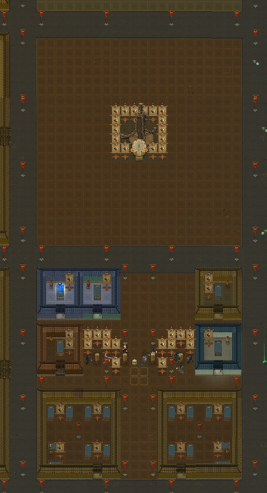
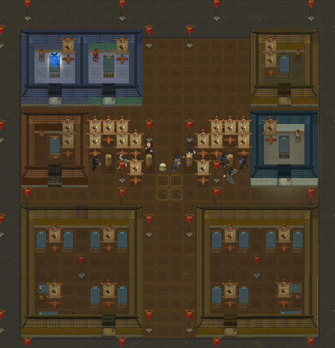
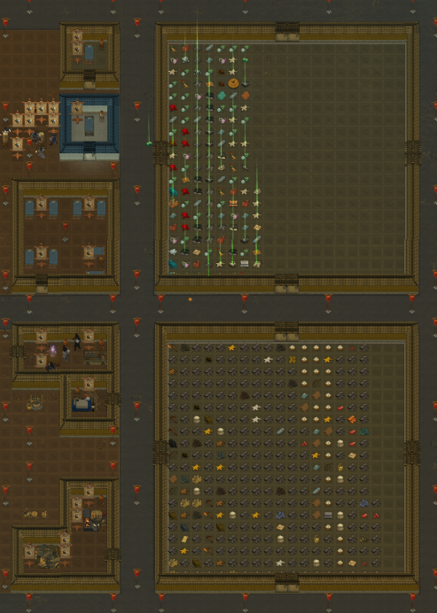
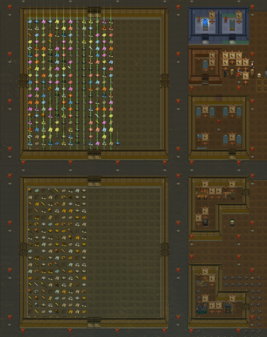
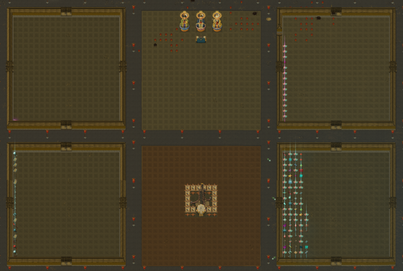
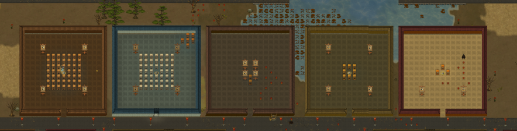
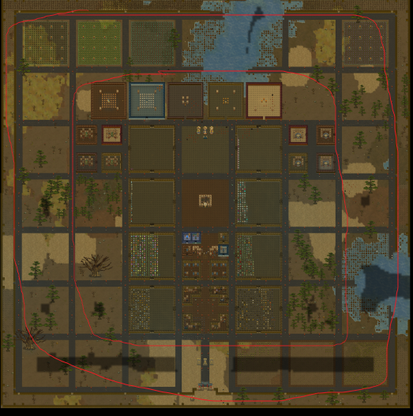
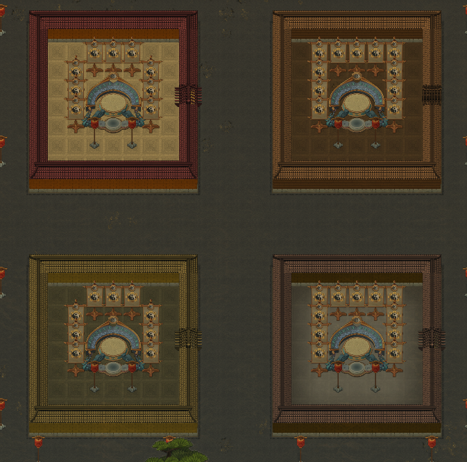
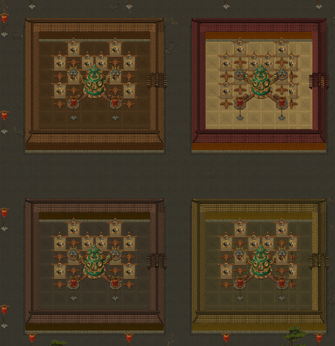
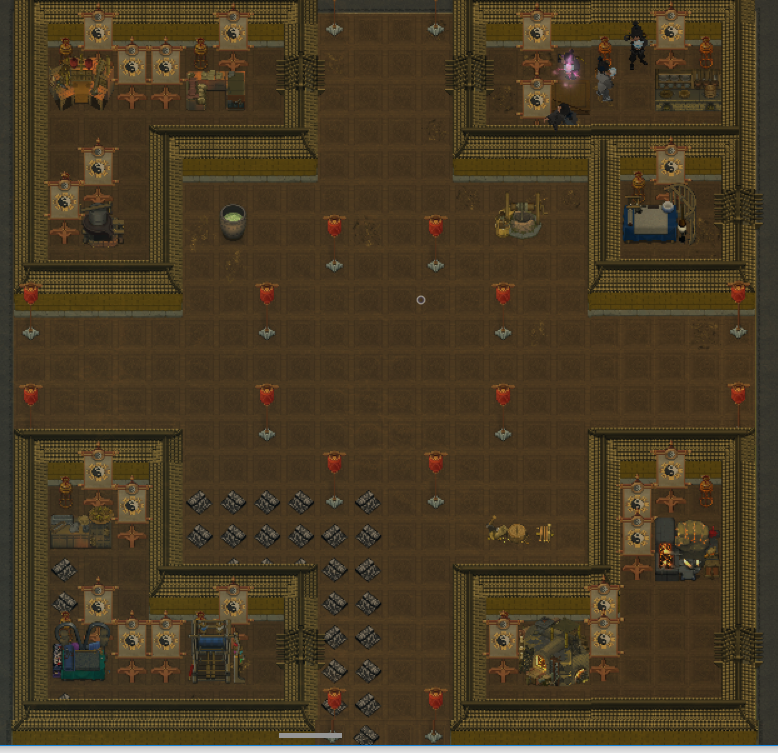

# 屠人五的布局指南

#### 很多玩家在玩游戏的时候不考虑门派布局，导致后期门派看起来很乱，所以这一篇是为大家提供一个范例，起一个抛砖引玉的作用，话不多说开始正文。 由于小地图和标准地图对于大型门派的建设有很多不方便的地方所以以下以大地图为例，大地图大小192x192，由于门派大门占用双数格子，而且个人喜欢方方正正和对称所以自己找到两格中轴线，地图格子数据为7+253+25+253+3+7，两个7是地图外围，25则是20\*20的大房间加上2墙壁加上3格的道路，如图

#### 这样的话门派就有49个20\*20的大区域，首先要知道自己的门派有什么，比如大门区，炼丹区，炼宝区，居住区，练功区，突破区，祖坟区，农田区，药田区，这样在各个格子里安排这些功能区就方便很多，中间的7个20\*20区域因为横跨中轴线所以建议将剑阵等每个门派只需要建设一个的建筑放在中轴线上，下面是我的门派图：

#### 护山大阵：这个门派布局最中央是护山大阵因为无论从哪里来敌人它的进攻路程都是相同的，而且位于居住区上方方便小人去开启。

#### 居住区：因为游戏最多只有18位弟子，居住区每个人的想法都不同这里不多做解释，这是我的居住区截图。外门采取员工集体宿舍，内门才有单独房间。当然风水都是大吉。

#### 仓库区：最下面的四个仓库存放1-5阶的物品，放置日常采集制造的物品，距离工作区，生活区和农田特别近方便搬运。

#### 炼丹炼宝区：地图上方两侧分别是炼丹区和炼宝区而且紧挨着6-12阶的四个仓库，因为里面的物品无非就是丹药和高阶武器法宝方便搬运，

#### 修炼区：5个修炼室，分别对应五行，应该是6个还有个无属性的我没造里面放上对应属性的灵物由于房间比较大所以还可以把高阶武器放进去养灵。

#### 种田区：四周最外围的20\*20我放置的种田区，一个是美观一个是方便管理，其他还剩几个区域预留下来以后突破渡劫用，其他的水池影响不大所以也就没管，等以后有了水上装饰就可以来个门派池塘。门派之外的7格我是为了防止敌人直接刷新在门派之内。还有其他具体细节大家可以天马行空进行设计。

#### 工作区

#### 关于什么时候开始设计布局，我推荐种好农田衣食无忧之后，开局之后可以简单把基础设施做出来，不能移动的建筑有水井，炉灶，炼宝台，炼丹台，这些可能要浪费一些材料，建议用农田画格子，因为农田不选择种植物小人不会和它交互，这样的话不耽误小人种田做饭，设计好之后就可以开始选择材料建造了，到后期肯定要用高阶材料全部替换，不过那都是玩到几百天之后了，这里再告诉大家一个小技巧灯柱的范围6\*6，用建造移动灯柱照亮迷雾比直接探索要安全而且省精力。 总之门派布局规划好之后无论是美观还是便利都很好，以上就是我的抛砖引玉的布局。

