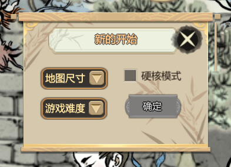
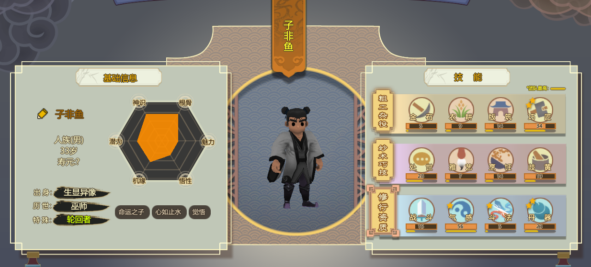
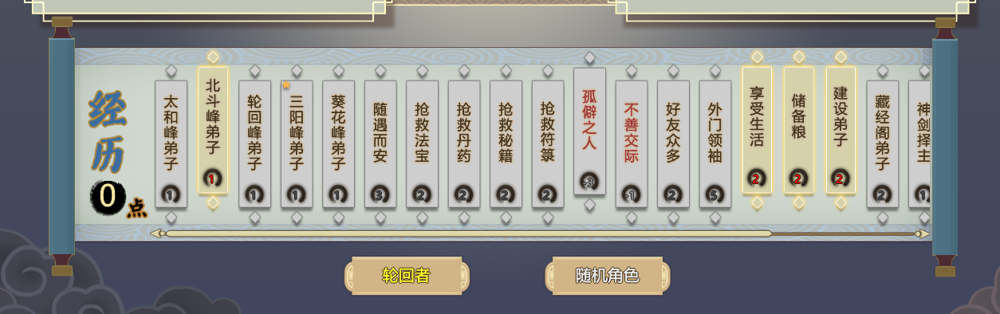

# 开局

### 经典模式有3个选项，如图所示：

* 地图尺寸：地图越大相对来说地图内资源越多，但是有可能你的出生点周围没有某些资源，而资源点集中在你出生点对角的位置，探索过去要很久。当然也有可能资源点就在你的出生点附近。 
* 游戏难度：顾名思义，这个选项代表了游戏的难易程度。在玩家选择之后，会在上图右边出现文字提示。 
* 硬核模式：不能SL！不能SL！不能SL！重要的话说三遍，开启该模式后，玩家无法手动存档，并会隐藏部分提示信息，使得游戏难度成倍增加。有难度，自然也就有好处，那两百多个成就，也只能在这个模式下解锁完成。（成就党加油！）

### 这些都已经选择好之后，在简单介绍了游戏背景之后，玩家便会进入到角色选择界面，如下图：

游戏内角色分为两种，随机、以及轮回者。随机角色的基础信息、能力完全随机；轮回者则是输入固定名字后，所有玩家得出的角色基础信息、能力、经历完全相同。 轮回者大部分都是根据名字随机生成的，小部分为制作组设定。（PS：强烈推荐轮回者子非鱼，谁用谁知道）。

* 上图左侧为角色的基础信息，角色姓名可以点击姓名左侧的铅笔图标更改，轮回者不能改名。 基础信息又分为个人信息、五维、身世、特性。
* 而在基础信息中，最为重要的，则是五维属性以及特性。 五维属性：角色的五种主要属性（潜力除外），鼠标指到每种属性上可以看到各个属性对应的东西。
*  五维属性还是你初期选择修行功法的首要指标。 特性：存在于五维属性之下，会有命运之子、心如止水等等，虽然没有明确数值，但却会在游戏中对人物产生一定影响。 
* 上图右侧为角色的能力栏，分三大类：粗工杂役、妙术巧技、修行资质。 除去修行资质外，粗工杂役、妙术巧技都可以由角色从事对应工作积累经验升级，前者则只能由一些特殊事件来进行升级。 每个角色都有自己侧重的能力类别，在大类的名字边框会比另两个多四个角。 
* 角色会根据自身经历以及一定的随机性，喜爱或着迷于某一些工作，具体的表现则是在该类工作上，会多出一到两颗星星。 该角色在从事对应工作时，会有加心情的buff。
* 且该能力升级需要的经验相比别的能力较少。 每个具体能力的评分数值代表对应的能力高低，由角色五维、特性、能力等级、伤势等共同决定。 
* 在每个能力的下方有一个黄色的条，代表当前能力的初始评分。

### 当选择好自己所钟意的角色后，玩家便可以进行下一步操作：选择角色经历。如下图：

> 除开功法外，每一个选项的五维加成以及其他属性加成，都只作用于第一个角色，物品则不受限制。 由于经历点有限，所以需要我们自行搭配，从而创造一个有利于自己的开局环境。 而当这些都完成之后，我们便可以正式的进入游戏，创造自己的仙门。

