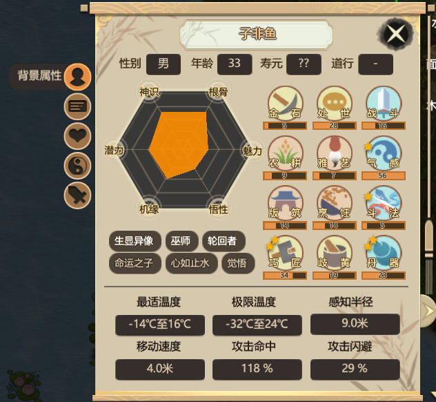
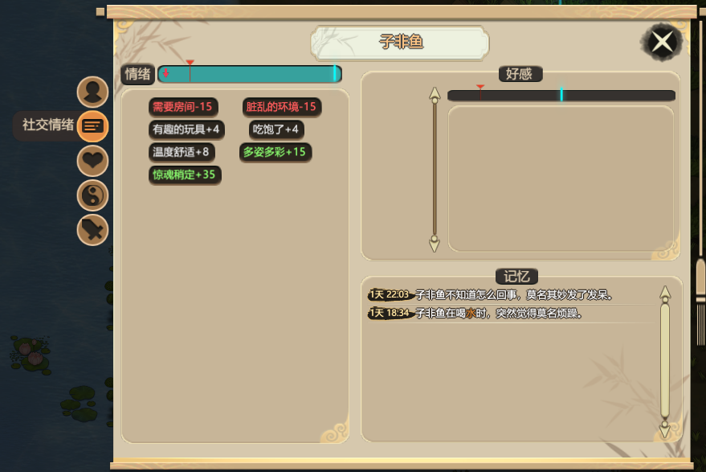
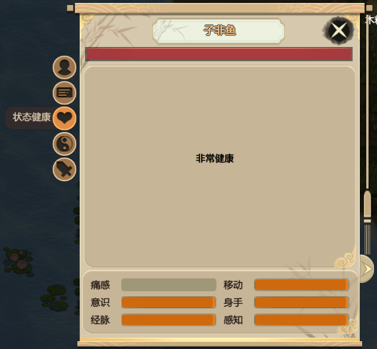
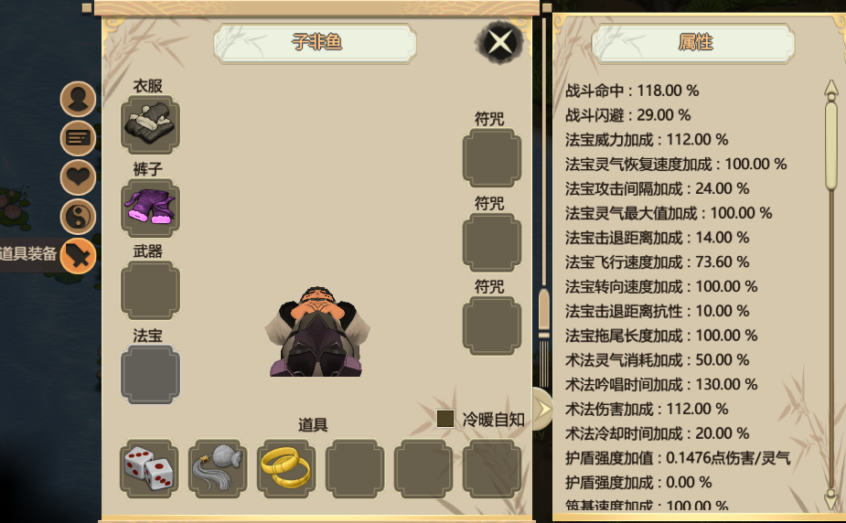

# 属性

### 每个角色，都有着各自的基础属性，如下图所示：

* 这里不仅有着先前选择角色时出现过的属性，还有着许多未曾出现的属性。 
* 年龄、寿元：年龄是角色当前的年纪，寿元则代表着这个人可以活多少岁。凡人无法预知自身寿元，只有筑基成功进入内门后，才会显示出寿元数值。 
* 游戏中许多神通、技能、药物等都会影响寿元的增长减少。个别技能则会影响年龄，如：入定。 道行：角色学习技能、突破境界都会增加道行，角色的道行越高，学习新技能所需要的参悟点也就越多。 
* 能力：与开局所讲相同，鼠标停留在能力上会显示当前能力的功能。 
* 最适温度、极限温度：当角色处于最适温度区间时，会有个温度舒适的buff，当角色处于最适温度与极限温度之间时，会有一个轻微的降低心情的buff。当角色处于极限温度之外时，角色会有一个大幅降低心情的buff，且呆的时间过长会中暑或冻伤，可叠加，直至死亡。 
* 攻击命中、攻击闪避：字面上就可以理解，代表角色的战斗属性。 右下角有个小箭头，点击可以看到已知该角色有关系的所有角色姓名及关系。

### 社交情绪篇：

* 每个角色都有着相应的情绪值没，在情绪面板可以看到影响角色情绪的因素，如上图所示，玩家可通关观察该面板，来了解角色当前的需求，从而创造有利于角色生存的环境。
* 情绪还会影响角色的工作效率、修炼效率等属性。 外门弟子情绪低于红色分界线时将会怠工，就是什么都不干，只娱乐、练功、闲逛，内门弟子情绪过低会走火入魔。 
* 右侧的好感代表该角色对另外的角色的感受，双方可能不一样。关系好了有什么影响未知。可能是交流的时候少打架多谈心？暂时来看无关紧要。 
* 记忆面板，记录了他的人生轨迹，偶尔会发生很好玩的事情。闲着没事的时候可以看看。

### 状态健康篇：

* 最上面显示的是角色的血条，血条空了，人就没了，血条受伤口影响。
* 中间区域显示的是角色受到的伤害或留下的疤痕，伤口上的数值表示当前部位受伤口影响之后还剩下多少能力值，指上去之后会显示影响的状态。
* 指到具体伤势名称上会显示影响数值、受伤程度、疼痛程度、愈合（恶化）趋势。 选择了郎中工作的角色会自动为受伤角色疗伤。智能选择药材。止痛散或内门伤害丹药要手动喂。如果郎中能力等级不够高可能会治不好，恶化后会留下永久性伤势，后期有药物可以治疗。
* 内门伤害无法自愈，具体伤口左侧会显示灵字或五行属性其中一种（如：金）五行属性伤害需要食用治疗五行伤害的丹药，灵气伤害需要食用化解灵气伤害的药物，某些功法拥有“化伤术”神通，可消耗灵气在非战斗状态下治疗所有内门伤害。 
* 最下面显示的是当前角色受到所有伤势影响之后的数值。痛感满了之后会疼晕过去。其余属性会影响能力评分，在角色能力上可以看到具体影响类型。 右下角有个小箭头，点击之后可以看到角色的耐药性。某些物品有耐药性，吃的越多效果越差（所有效果，包括属性加成、筑基值等），在物品描述上有写。

### 道具装备篇：

* 装备栏分为衣服、裤子、武器、法宝、符咒、道具等。 
* 衣服、裤子主要影响温度，神兽皮制作的服装会增加护盾转化加成。 
* 武器主要影响外门弟子战斗力，内门弟子未装备法宝或法宝与本身灵气都耗光之后也会拎着武器去战斗。 
* 法宝影响内门弟子法宝战斗力，装备界面显示的是法宝属性基础值，经过各种加成之后的属性显示在功法修行面板。
* 角色内功属性生法宝属性，有额外加成（例：金角色装备水属性法宝）。 
* 符咒栏可以装备由内门弟子绘制的符咒，增加各种属性，具体会在之后的画符相关详细介绍。 
* 道具栏可以装备很多东西，包括工具、饰品、秘籍等。 
* 道具栏右上角的冷暖自知选中后会根据温度自动换衣服。 
* 冷暖自知右侧的小箭头点开之后可以看到角色的详细属性，非常详细，包括心境基础值、基础修炼速度、各种能力的加成等等。

