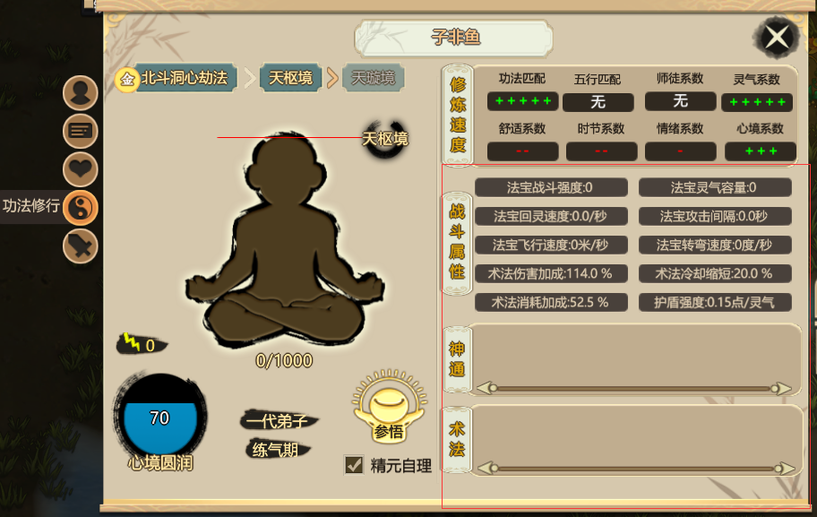

# 修行与战斗

### 外门弟子，在角色面板上，会有一个功法修行的界面，如下图：

* 当筑基进度满值后，就可以操作角色晋升为内门弟子。 外门弟子练功可通过日常练功，食用增加筑基值的药物来增加筑基值。 
* 游戏开局会送一枚筑基丹，吃了之后筑基进度直接满值。可以直接晋升内门，但是不推荐直接吃，推荐留到结丹吃。 
* 晋升内门弟子的时候会让你选择修习功法，初始门派经历可以选择自己想学的功法，如果不选的话会随机给一本初始可选功法。每种功法属性要求、侧重方向、突破方式等都不一样。
* 点击选择功法会显示当前功法侧重方向等信息。成功成为内门弟子后，先前的筑基界面，则会发生变化，

### 如上图所示：小人下方数值表示“角色修为/本层修为上限”，修为满了并成功突破大瓶颈就会晋级功法下一层。

* 角色身上的红线代表了瓶颈，当角色到了瓶颈需要突破瓶颈才能继续增加修为，角色困在一个瓶颈过久会有减少心情的负面状态。不同功法、不同瓶颈突破需求也不一样。
* 右侧属性分别为修炼速度、战斗属性、神通、术法：
* 修炼速度显示了大部分影响你修炼速度的因素，加号越多越好。
* 功法匹配是你角色五维与功法要求的五维匹配程度，选择功法的时候可以看到，点击修炼面板左上角的功法名称也可以看到当前匹配度。每种功法的属性要求不同，匹配度最低50%最高可达到200%以上。 五行匹配是你当前所处位置五行属性对于功法的影响，可以通过放置装饰建筑来改变一个地点的五行属性。周围五行属性生你功法的属性足够高时就会是5个加号。 
* 师徒系数代表这个角色拜的师傅对这个角色修炼的影响，相同功法是5个加号。每个角色只能拜师一次。只有师傅才能传授徒弟技能。 
* 灵气系数代表角色周围灵气浓度对修炼功法的影响，灵气浓度越高，修炼越快。 舒适系数，代表当前所处位置的舒适程度，舒适度越高修炼越快。 
* 时节系数，代表当前所处时节对修炼功法的影响。春季属木、夏季属火、秋季属金、冬季属水、土属性则在每季度末尾和刚开始最强。时节刚开始从土属性向当前时节属性偏移，直至季中本季属性达到巅峰。然后向土属性偏移。 情绪系数、心境系数代表角色情绪、心境对修炼的影响。情绪越好、心境越高，角色修炼速度越快。
* 小人左侧的闪电标志代表天谴值，天谴越高，渡劫时天劫越强，越难度过。内门弟子攻击凡人、野兽、使用邪法等都会增加天谴值。目前没有消除天谴的方法，之后据说会有。
* 天谴值下方是心境值，心境影响修炼相关的很多东西，心境由心境基础值+调心获得值得来，角色情绪越好，调心速度越快，心境越接近100调心速度越慢。 游戏中，一些饰品、技能、药物可以增加心境基础值，心境基础值95以上就可以不调心全程修炼。调心最高能达到100心境，增加心境基础值的物品、技能、药物可以把心境推到100以上，但是没什么用。心境基础值在道具装备界面可以看到。

### 心境右侧是角色参悟面板，点开后是学习技能面板：

* 上半区是功法技能树，到达对应境界后才可以学习该境界的技能，不同功法技能树不同。 
* 左下角是所有角色都一样的个人技能：
* 御器影响法宝战斗属性；术法影响术法战斗属性；护体影响护盾强度；炼丹影响角色炼丹速度、炼丹数量加成、炼丹成功率等炼丹方面的属性；炼器影响角色炼器速度、炼器成功率、炼器品阶加成等炼器方面的属性。
* 附加秘籍指通过读书、传授、历练等学习的新技能。 
* 传授是本游戏最厉害的系统，传授无前置技能要求、无视技能不能共存的限制（先学另一个，再传授），只要境界足够就可以学会，而且需要的参悟值是自己学习该技能所需的一半。

### 战斗系统：

* 战斗属性代表你角色的战斗能力。有的功法偏向驾驭法宝战斗，有些功法偏向于释放术法来战斗。 偏向法宝战斗的功法主要增加法宝战斗强度、法宝灵气容量、法宝回灵速度、法宝飞行速度、法宝转弯速度。法宝攻击间隔固定。
* 法宝战斗强度表示当前装备法宝每次攻击可以对敌人造成的伤害。如果一次造成伤害超过敌人灵气护盾总值，有概率直接击倒敌人。 法宝灵气容量表示法宝本身可吸收的灵气上限，法宝只会从角色身上吸取灵气，当法宝在角色身上且法宝灵气未到达上限时会吸收角色灵气回复直到上限，当灵气耗尽法宝会自动回到角色身上吸收灵气，期间只能挨打无法反击，当角色与法宝都没灵气的时候法宝就不能用了，角色会拎着武器上去肉搏。 法宝回灵速度表示法宝吸收角色灵气的速度。 法宝攻击间隔表示角色每次控制法宝的间隔，并非法宝攻击敌人的速度。 法宝飞行速度、转弯速度代表法宝灵活性。
* 偏向术法的功法主要增加术法伤害加成、术法消耗加成、术法冷却缩短等属性。简单明了，略过。 护盾强度：战斗属性里最重要的一个属性，护盾强度表示受到攻击时灵气转化成护盾的数值。例如护盾强度0.12/灵气表示每100点灵气能抵消12点伤害。在灵气未耗光之前本体不会受伤。所有角色的本体都很脆弱，没有灵气基本上代表死亡。
* 神通是非战斗状态释放的辅助技能。 术法是战斗时释放的技能，有攻击、防御、辅助三种。术法有些是功法自带的技能，有些是获得的技能书里面记载的，技能书里记载的术法属性随机，可能出现很强力的技能。 神通在非战斗状态在角色面板右侧显示，术法在战斗状态在角色面板右侧显示。 当你已经完全熟悉这些界面内容后，你便已经完全踏入了修仙的大门。

